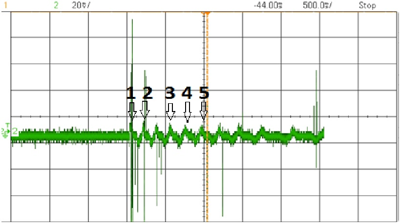

# Understanding the Basics of a Generator

Using simple components that can purchased at a local hardware store
anyone has the capability to produce or create their own power. To be
able to create your own power one must first understand the basics of a
single phase generator. The most intuitive way to comprehend the
characteristics of a generator is through hands on testing and
experimentation.  In this report we will be examining three different
setups that will in detail describe the interaction of the different
components, the significance of the numbers found on the oscilloscope,
Faradays Law, and unforeseen issues that may arise while testing. The
three setups include: a simple nail wrapped in copper wire, a single
phase generator that only produces positive power, and a single phase
generator that produces both positive and negative power. Each set up
will build off of the last and demonstrate different characteristics of
a generator.

# Experiment 1

The goal of the first set up of having a nail wrapped in copper wire is
to introduce the possibilities and power that can be generated from
three simple components. As depicted below three elements are used in
this test: copper wire, a nail, and a magnet. To measure the voltage
that is produced from this set up you must first strip the ends of the
copper wire and attach either a volt meter or oscilloscope probes.

